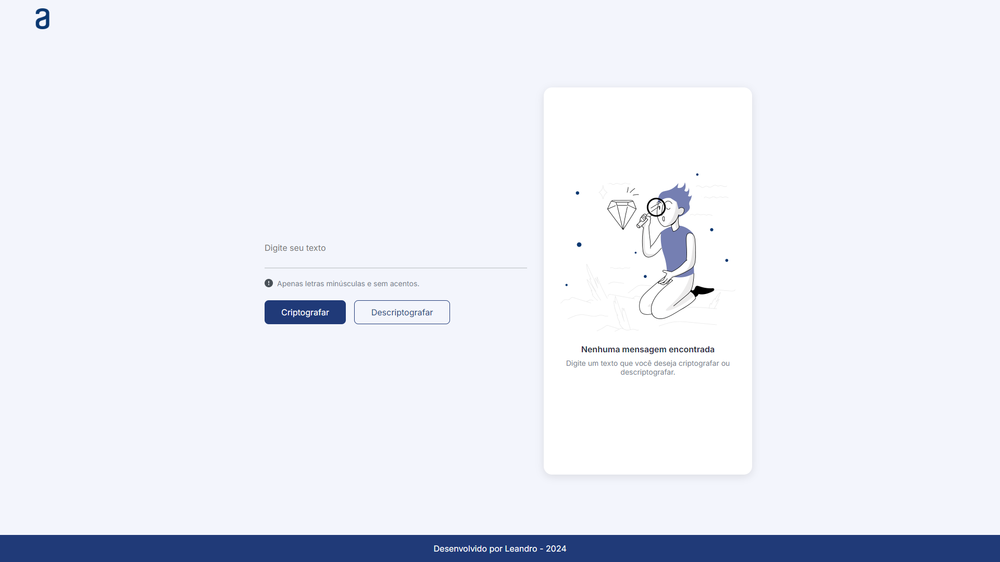

# Decodificador de texto

## Descrição

Este é um projeto simples de criptografia que permite converter texto em uma versão criptografada e descriptografar a versão criptografada de volta ao texto original. O projeto usa um esquema de criptografia baseado em substituições de caracteres e está disponível para letras minúsculas apenas, sem acentos ou caracteres especiais.

## Funcionamento

O texto é criptografado e descriptografado com base nas seguintes regras:
- A letra **"e"** é convertida para **"enter"**
- A letra **"i"** é convertida para **"imes"**
- A letra **"a"** é convertida para **"ai"**
- A letra **"o"** é convertida para **"ober"**
- A letra **"u"** é convertida para **"ufat"**

Você pode criptografar e descriptografar o texto diretamente na interface web fornecida.

## Requisitos

- O texto deve conter apenas letras minúsculas e sem acentos.
- Não deve conter caracteres especiais.

## Tecnologias Usadas

  

## Previa do projeto

  

